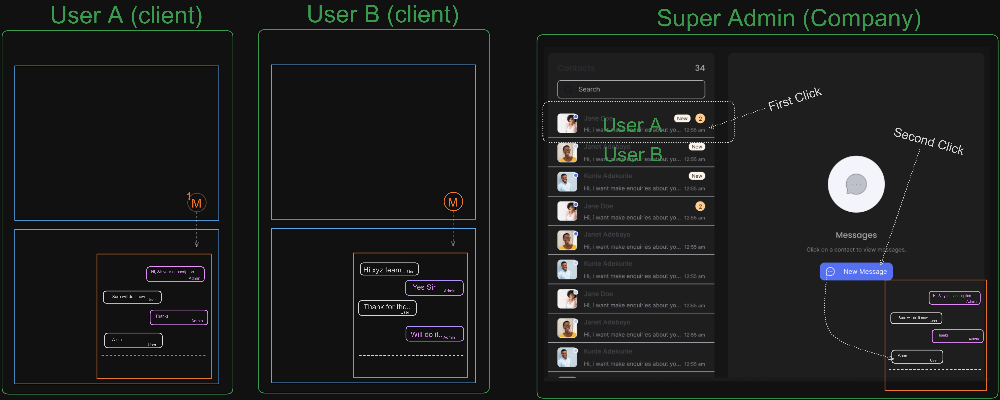

## Requirement
1. User Roles:
- Multiple admins (users) can chat with the company
- Company (Super Admin) can chat with multiple admins

2. Chat Functionality:
- User A and User B are administrators, not clients.
- The "Super Admin" represents the company.

3. Interface Layout:
- Chat box for both with same interface
- A chat popup will appear when the user(admin) clicks on the button, allowing them to chat with the super admin.
- Similarly, from the super admin panel's left layout, the Super Admin can select any client (admin) and click on "New Message" to directly send a message to the client (admin).

## Development Process

#### Day 1 (Monday) - Basic Authentication Setup

Backend Developer Task:
1. Create a simple email/password authentication system (without JWT for testing).
2. Implement user signup with email, password, and role selection. [`Signup: 3 fields: email, pass, role SignIn: 2 fields: email, pass and return role`]
3. Implement user signin, returning the role upon successful authentication.
4. Ensure the system differentiates between admin and super admin roles for chat purposes (make a basic guard(middleware) in nestJs)

Frontend Developer Task:
1. Create a basic signup/signin form.
2. Connect the form to the backend API using axios or react-query.
3. Store the returned role in a global state management system (Redux).
4. No form validation required at this stage.

#### Day 2 (Tuesday) - Study Existing Codebase

Both Backend and Frontend Developers:
1. Review `provided scalable frontend and backend code`.[`I'm gonna provide 80% codebase`]
2. Set up and test the system with Redis credentials.
3. Understand the integration of Redis server.

#### Day 3 (Wednesday) - Research and Code Understanding

Both Developers:
1. Focus on understanding Prisma, Redis, MongoDB, and Socket.io in NestJS.
2. Study the provided code thoroughly.
3. Conduct independent research to deepen understanding.

#### Day 4 (Thursday) - Implement Chat Logic

Backend Developer Task:
1. Create a guard (middleware) to handle role-based chat access.
2. Implement chat functionality between admin and super admin based on roles.

Frontend Developer Task:
1. Design and implement a chat button and UI for both admin and super admin.
2. Improve upon the basic provided chat interface.

#### Day 5 (Friday) - Database Integration and State Management

Backend Developer Task:
1. Set up Prisma with MongoDB.
2. Implement chat message storage in MongoDB.

Frontend Developer Task:
1. Use React Query for initial state setup.
2. Implement chat history persistence across page reloads.
3. Ensure proper connection with the backend.

#### Day 6 (Saturday) - Completion and Refinement

Both Developers:
1. Complete any remaining tasks from previous days.
2. Refine and optimize implemented features.

#### Day 7 (Monday) - Testing

Both Developers:
1. Conduct thorough manual testing of the entire system.
2. Identify and fix any bugs or issues.
3. Ensure smooth functionality of authentication and chat features.


------

`Prisma Schema`
> You can modify it if needed

```prisma
datasource db {
  provider = "mongodb"
  url      = env("DATABASE_URL")
}

generator client {
  provider = "prisma-client-js"
}

model User {
  id        String    @id @default(auto()) @map("_id") @db.ObjectId
  name      String
  email     String    @unique
  role      Role      @default(ADMIN)
  chats     Chat[]    @relation("UserChats")
  messages  Message[]
}

model Chat {
  id        String    @id @default(auto()) @map("_id") @db.ObjectId
  users     User[]    @relation("UserChats")
  messages  Message[]
}

model Message {
  id        String   @id @default(auto()) @map("_id") @db.ObjectId
  content   String
  chat      Chat     @relation(fields: [chatId], references: [id])
  chatId    String   @db.ObjectId
  sender    User     @relation(fields: [senderId], references: [id])
  senderId  String   @db.ObjectId
  createdAt DateTime @default(now())
}

enum Role {
  ADMIN
  SUPER_ADMIN
}
```
